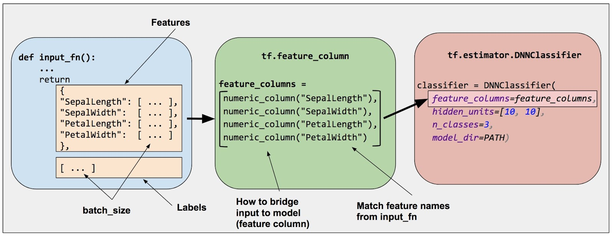

# Estimators

## Premade Estimators

### Overview of programming with Estimators

To write a TensorFlow program based on pre-made estimators, you must perform the following tasks:

- Create one or more input functions
- Define the model's feature columns
- Instantiate an Estimator
- Call one or more methods on the Estimator object, passing the appropriate input function as the source of the data

## Iris classification

### Create input functions

An **input function** is a function that returns a tf.data.Dataset object which outputs the following two-element tuple:

- `features` - a Python dictionary:

    + each key is the name of a feature
    + each value is an array containing all of that feature's values.

- `label` - an array containing the values of the `label` for every example:

```python
import numpy as np

def input_evaluation_set():
    features = {'SepalLength': np.array([6.4, 5.0]),
                'SepalWidth': np.array([2.8, 2.3]),
                'PetalLength': np.array([5.6, 3.3]),
                'PetalWidth': np.array([2.2, 1.0])}
    labels = np.array([2, 1])
    return features, labels
```

Here is the input function used for training in this program:

```python
def train_input_fn(features, labels, batch_size):
    """An input function for training"""
    # Convert the inputs to a Dataset
    dataset = tf.data.Dataset.from_tensor_slices((dict(features), labels))

    # Shuffle, repeat, and batch the examples
    return dataset.shuffle(1000).repeat().batch(batch_size)
```

### Define the feature columns

A `feature column` is an object describing how the model should use raw input data from the features dictionary. The `tf.feature_column` module provides many options for representing data to the model.

```python
# Feature columns describe how to use the input data
my_feature_columns = []
for key in train_x.keys():
    my_feature_columns.append(tf.feature_column.numeric_column(key=key))
```

### Instantiate an estimator

TensorFlow provides several pre-made classifier Estimators, including:

- `tf.estimator.DNNClassifier` for deep models that perform multi-class classification

- `tf.estimator.DNNLinearCombinedClassifier` for wide & deep models

- `tf.estimator.LinearClassifier` for classifiers based on linear models

For the Iris classification, `tf.estimator.DNNClassifier` seems like the best choice.

```python
# Build a DNN with 2 hidden layers and 10 nodes in each hidden layer
classifier = tf.estimator.DNNClassifier(
    feature_columns=my_feature_columns,
    hidden_units=[10, 10],
    n_classes=3)
```

### Train, Evaluate, and Predict

#### Train the model

```python
classifier.train(
    input_fn=lambda:iris_data.train_input_fn(train_x, train_y, args.batch_size),
    steps=args.train_steps)
```

#### Evaluate the trained model

```python
eval_result = classifier.evaluate(
    input_fn=lambda:iris_data.eval_input_fn(test_x, test_y, args.batch_size))
print("Test set accuracy: {accuracy:0.3f}".format(**eval_result))
```

#### Making predictions from the trained model

```python
# Generate predictions from the model
expected = ['Setosa', 'Versicolor', 'Virginica']
predict_x = {
    'SepalLength': [5.1, 5.9, 6.9],
    'SepalWidth': [3.3, 3.0, 3.1],
    'PetalLength': [1.7, 4.2, 5.4],
    'PetalWidth': [0.5, 1.5, 2.1],
}

predictions = classifier.predict(
    input_fn=lambda:iris_data.eval_input_fn(predict_x,
                                            batch_size=args.batch_size))

template = ('\nPrediction is "{}" ({:.1f}%), expected "{}"')

for pred_dict, expec in zip(predictions, expected):
    class_id = pred_dict['class_ids'][0]
    probability = pred_dict['probabilities'][class_id]

    print(template.format(iris_data.SPECIES[class_id],
                          100 * probability, expec))
```

## Checkpoints

TensorFlow provides two model formats

- checkpoints, which is a format dependent on the code that created the model
- SavedModel, which is a format independent of the code that created the model

### Saving partially-trained models

Estimators automatically write the following to disk:

- **checkpoints**, which are versions of the model created during training
- **event files**, which contain information that `TensorBoard` uses to create visualizations

```python
classifier = tf.estimator.DNNClassifier(
    feature_columns=my_feature_columns,
    hidden_units=[10, 10],
    n_classes=3,
    model_dir='models/iris')
```

As suggested by the following diagrams, the first call to `train` adds checkpoints and other files to the `model_dir` directory:


source: https://www.tensorflow.org/images/first_train_calls.png

You may alter the default schedule by taking the following steps:

- create a `tf.estimator.RunConfig` object that defines the desired schedule
- When instantiating the Estimator, pass that `RunConfig` object to the Estimator's `config` argument

```python
my_checkpointing_config = tf.estimator.RunConfig(
    # Save checkpoints every 20 minutes
    save_checkpoints_secs = 20*60,
    # Retain the 10 most recent checkpoints
    keep_checkpoint_max = 10
)

classifier = tf.estimator.DNNClassifier(
    feature_columns=my_feature_columns,
    hidden_units=[10, 10],
    n_classes=3,
    model_dir='models/iris',
    config=my_checkpointing_config)
```

### Restoring your model


source: https://www.tensorflow.org/images/subsequent_calls.png

## Feature Columns

### Input to a Deep Neural Network

What kind of data can a deep neural network operate on? The answer is, of course, **numbers** (for example, `tf.float32`)

### Feature Columns

You specify the input to a model through the `feature_columns` argument of an Estimator. Feature columns bridge input data (as returned by `input_fn`) with your model.



source: https://www.tensorflow.org/images/feature_columns/inputs_to_model_bridge.jpg

#### numeric column

- `tf.feature_column.numeric_column`

#### bucketized column

- `tf.feature_column.bucketized_column`

#### categorical identity column

- `tf.feature_column.categorical_column_with_identity`

```python
# Create categorical output for an integer feature named "my_feature_b",
# The values of my_feature_b must be >= 0 and < num_buckets
identity_feature_column = tf.feature_column.categorical_column_with_identity(
    key='my_feature_b',
    num_buckets=4) # Values [0, 4)

# In order for the preceding call to work, the input_fn() must return
# a dictionary containing 'my_feature_b' as a key. Furthermore, the values
# assigned to 'my_feature_b' must belong to the set [0, 4).
def input_fn():
    # ...
    return ({ 'my_feature_a':[7, 9, 5, 2], 'my_feature_b':[3, 1, 2, 2] },
            [Label_values])
```

#### categorical vocabulary column

TensorFlow provides two different functions to create categorical vocabulary columns:

- `tf.feature_column.categorical_column_with_vocabulary_list`

```python
# Given input "feature_name_from_input_fn" which is a string,
# create a categorical feature by mapping the input to one of
# the elements in the vocabulary list.
vocabulary_feature_column =
    tf.feature_column.categorical_column_with_vocabulary_list(
        key=feature_name_from_input_fn,
        vocabulary_list=["kitchenware", "electronics", "sports"])
```

- `tf.feature_column.categorical_column_with_vocabulary_file`

```python

# Given input "feature_name_from_input_fn" which is a string,
# create a categorical feature to our model by mapping the input to one of
# the elements in the vocabulary file
vocabulary_feature_column =
    tf.feature_column.categorical_column_with_vocabulary_file(
        key=feature_name_from_input_fn,
        vocabulary_file="product_class.txt",
        vocabulary_size=3)
```

### Indicator and embedding columns

### Passing feature columns to Estimators

- `tf.estimator.LinearClassifier` and `tf.estimator.LinearRegressor`: Accept all types of feature column

- `tf.estimator.DNNClassifier` and `tf.estimator.DNNRegressor`: Only accept dense columns. Other column types must be wrapped in either an `indicator_column` or `embedding_column`

- `tf.estimator.DNNLinearCombinedClassifier` and `tf.estimator.DNNLinearCombinedRegressor`:

    - The `linear_feature_columns` argument accepts any feature column type
    - The `dnn_feature_columns` argument only accepts dense columns

## Datasets for Estimators


## Reference

- https://www.tensorflow.org/guide/premade_estimators
